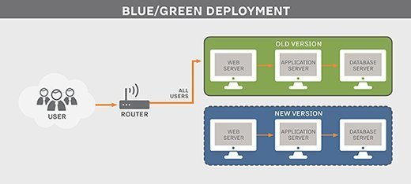

# Blue Green deployment

## Overview

## What is blue green deployment ?

Blue Green deployment is a technique that reduces downtime and risk by running two identical production environments called Blue and Green.

## How it works ?

At any time, only one of the environments is live, with the live environment serving all production traffic and the other environment being idle.

We use a router to redirect all incoming traffic to the live environment. When we want to deploy new version of services we deploy only to the idle environment and after extensive testing we make the router switch environment. Now the environment that was idle is the live environment and has newest version of services.

## Advantages

This technique can eliminate downtime due to app deployment. In addition, blue green deployment reduces risk: if something unexpected happens with your new version on Green, you can immediately roll back to the last version by switching back to Blue.

## Example

As you prepare a new version of your software, deployment and the final stage of testing takes place in the environment that is not live: in this example, Green. Once you have deployed and fully tested the software in Green, you switch the router so all incoming requests now go to Green instead of Blue. Green is now live, and Blue is idle.
